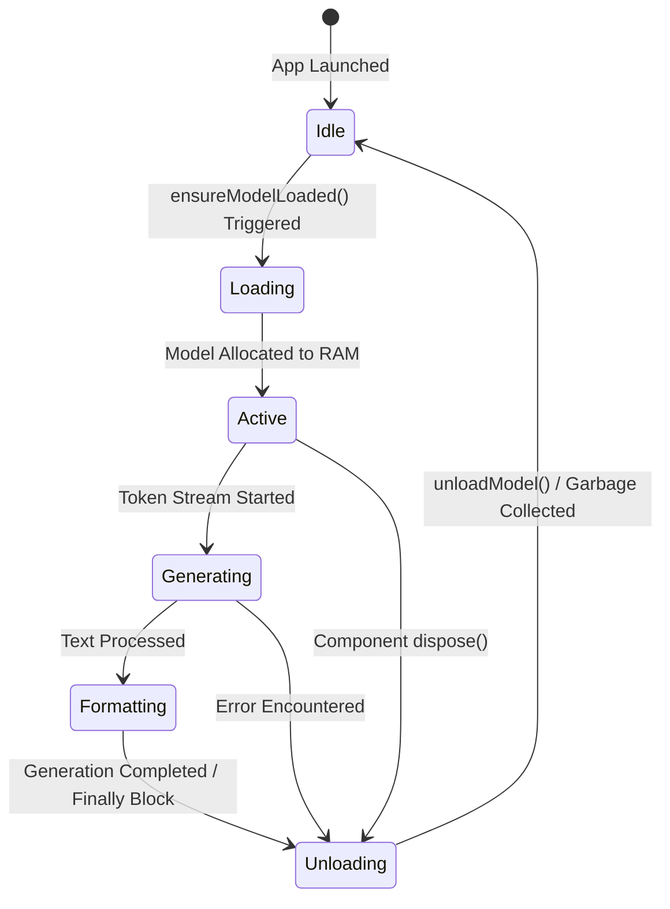

# Technical Architecture & Model Management

## LLM Strategy

SilentScribe relies entirely on edge-based, offline AI models to ensure user privacy and maximum speed without network dependencies. The selection of models is heavily tuned for mobile device constraints and performance tiering.

### Model Comparison & Rationale

| Model | Architecture | File Size (Approx) | Rationale for Selection |
| :--- | :--- | :--- | :--- |
| **Whisper Tiny (English)** `ggml-tiny.en.bin` | Automatic Speech Recognition (ASR) | ~75 MB | Selected for optimal balance between accuracy and edge-device latency. Provides rapid offline transcription with minimal memory footprint, essential for standard voice memo processing. |
| **Qwen 2.5 0.5B Instruct** `qwen2.5-0.5b-instruct-q4_k_m.gguf` | Large Language Model (Instruction Tuned) | ~350 MB | Chosen for its extremely lightweight nature (0.5B parameters) combined with robust reasoning capabilities. The 4-bit quantization allows it to run smoothly within tight mobile RAM constraints while effectively transforming disjointed text into polished drafts. |

## Hardware Utilization & Tiering

SilentScribe implements a dynamic compute strategy that scales based on the host device's capabilities (RAM and SoC).

### Compute Tiers

| Tier | Requirements | Strategy | Context Size |
| :--- | :--- | :--- | :--- |
| **Ultra** | 8GB+ RAM & Flagship SoC* | **GPU Accelerated**: Uses GPU/NPU delegates. | 16,384 tokens |
| **Balanced** | 4GB - 8GB RAM | **Optimized**: iOS uses GPU; Android uses CPU. | 8,192 tokens |
| **Legacy** | < 4GB RAM | **Safety Mode**: iOS uses GPU; Android uses multi-threaded CPU. | 4,096 tokens |

*\*Flagship SoCs include Apple A14+, Snapdragon 8 Gen 1+, Google Tensor, and Dimensity 9000+.*

### GPU Orchestration
On high-tier devices, the `LLMService` initializes the Llama engine with GPU support (`useGpu: true`, `nGpuLayers: -1`). This significantly reduces thermal throttling and increases token generation speed by offloading tensor math from the CPU.

## Memory Lifecycle & Stability

Aggressive memory management is critical for running generative AI on edge devices. SilentScribe orchestrates model states carefully to prevent system crashes (`OutOfMemory` errors).

### Stability Hooks

1.  **Memory Recovery Delay**: After transcription completes, the application enforces a **1000ms cooldown** before loading the LLM. This allows the OS to reclaim native buffers used by the Whisper engine, preventing peak memory spikes.
2.  **Optimized Mobile Batch Size**: To prevent OOM (Out of Memory) crashes on mobile devices, the `batchSize` is decoupled from the `contextSize` and set to a safe standard of **512**. This drastically reduces peak memory overhead while maintaining full context window capabilities.
3.  **iOS Universal GPU Acceleration**: All iOS devices force `useGpu: true`. The Apple Metal/Neural Engine backend is significantly more memory and energy efficient than CPU multi-threading for inference tasks.
4.  **Android Large Heap**: The application manifest enables `android:largeHeap="true"`, requesting a larger memory budget from the Android OS for the Dalvik/ART heap.
5.  **Safety Truncation**: Inputs are automatically truncated based on a density of **2.5 characters per token**. This prevents the LLM from exceeding its allocated context window.

## Agentic Workflow & Vibe Coding

SilentScribe’s development leverages 'vibe coding' sessions which iteratively define architecture and behavior. 

1. **Session Context Capture**: Decisions—such as shifting from Llama to Qwen due to high memory pressure or implementing batch-sync for stability—are surfaced dynamically during build sessions.
2. **Persistent Knowledge Items (KIs)**: These critical architectural constraints are documented and saved as KIs locally. 
3. **Contextual Influence**: In subsequent generation tasks or refactorings, the overarching LLM coding assistant queries these KIs to maintain strict adherence to our mobile edge-device limitations (e.g. avoiding bloated imports, enforcing aggressive garbage collection) preventing regression over time.

