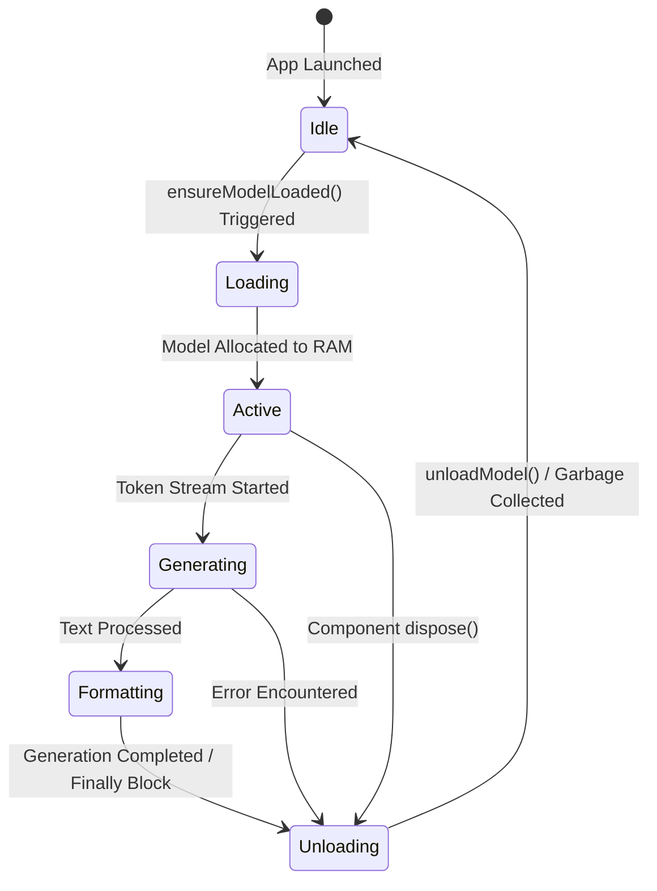

# Technical Architecture & Model Management

## LLM Strategy

SilentScribe relies entirely on edge-based, offline AI models to ensure user privacy and maximum speed without network dependencies. The selection of models is heavily tuned for mobile device constraints.

### Model Comparison & Rationale

| Model | Architecture | File Size (Approx) | Rationale for Selection |
| :--- | :--- | :--- | :--- |
| **Whisper Tiny (English)** `ggml-tiny.en.bin` | Automatic Speech Recognition (ASR) | ~75 MB | Selected for optimal balance between accuracy and edge-device latency. Provides rapid offline transcription with minimal memory footprint, essential for standard voice memo processing. |
| **Qwen 2.5 0.5B Instruct** `qwen2.5-0.5b-instruct-q4_k_m.gguf` | Large Language Model (Instruction Tuned) | ~350 MB | Chosen for its extremely lightweight nature (0.5B parameters) combined with robust reasoning capabilities. The 4-bit quantization allows it to run smoothly within tight mobile RAM constraints while effectively transforming disjointed text into polished drafts. |

## Memory Lifecycle

Aggressive memory management is critical for running generative AI on edge devices. SilentScribe orchestrates model states carefully to prevent system crashes (`OutOfMemory` errors).

### Key Triggers for Memory Release
- **Immediate Task Disposal**: The LLM is strictly unloaded (`_llmService.unloadModel()`) inside `finally` blocks immediately after the text formatting stream completes. Models are never kept resident in memory to preserve system stability for background operations.
- **Widget Lifecycle Lifecycle**: If a user navigates away mid-generation or the screen is torn down, Flutter's `dispose()` lifecycle hooks aggressively trigger model eviction.
- **Lazy Loading**: Models (`FlutterLlama.instance`) are completely inactive until an explicit generation request is made.

## Hardware Utilization

SilentScribe utilizes predictive hardware checks gracefully to manage user expectations and system constraints.

- **Pre-Flight Memory Audit**: The `PerformanceCheckScreen` actively polls the system for available RAM before allowing deployment. High-tier devices skip warnings; devices under `5.5GB` total RAM surface warnings, and devices `< 3.5GB` are blocked to prevent OS-level app termination.
- **Thread Constraints**: Offloads intensive generation tasks cleanly without choking the main UI thread.
- **No GPU Overhead (Currently)**: Models are calibrated to run efficiently on CPU (`useGpu: false`) ensuring wide compatibility across varying mobile SOCs.

## Agentic Workflow & Vibe Coding

SilentScribe’s development leverages 'vibe coding' sessions which iteratively define architecture and behavior. 

1. **Session Context Capture**: Decisions—such as shifting from Llama to Qwen due to high memory pressure on limited RAM Android devices—are surfaced dynamically during build sessions.
2. **Persistent Knowledge Items (KIs)**: These critical architectural constraints are documented and saved as KIs locally. 
3. **Contextual Influence**: In subsequent generation tasks or refactorings, the overarching LLM coding assistant queries these KIs to maintain strict adherence to our mobile edge-device limitations (e.g. avoiding bloated imports, enforcing aggressive garbage collection) preventing regression over time.
